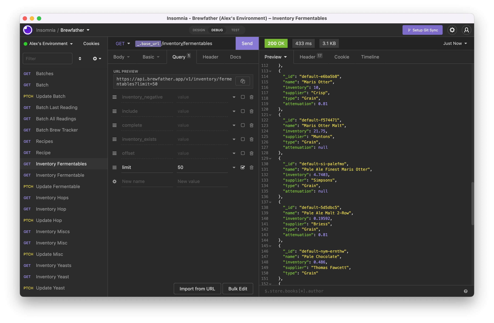

# Insomnia Configuration for the Brewfather API

The repo contains configuration for Insomnia to easily query the [Brewfather API](https://docs.brewfather.app/api).

### Steps:

- [Generate an API-Key](https://docs.brewfather.app/api#generate-api-key) in Brewfather 
- Install [Insomnia](https://insomnia.rest/download)
- Install [insomnia-plugin-prompt](https://www.npmjs.com/package/insomnia-plugin-prompt) from Preferences -> Plugins
- [Import](https://docs.insomnia.rest/insomnia/import-export-data#import-data) `insomnia_brewfather.json` from this repo
- Configure the `Change me!` [Environment](https://docs.insomnia.rest/insomnia/environment-variables/#environment-basics) with your Brewfather UserID and API-Key
- Select the desired API endpoint from the left panel, populate any query parameters  needed and hit `Send`.